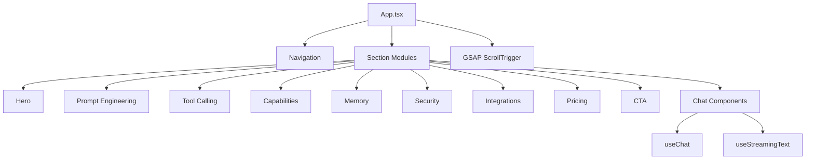

# AI SaaS Chat Interface

<div align="center">


A cinematic, conversion-first AI SaaS landing page and product demo experience.

[Visit Website](https://rahul-panda564.github.io/AI_SAAS_CHAT_INTERFACE/) • [Features](#features) • [Architecture](#architecture) • [Quick Start](#quick-start)

</div>

## Why This Project

This project showcases a modern AI product website with a strong focus on:

- Scroll storytelling and motion design
- Product-style UX for prompt engineering and tool calling
- Reusable component architecture for scale
- Recruiter-friendly implementation quality and code organization

## Live Product Sections

- Hero: AI platform positioning with animated chat UI
- Prompt Engineering: visual editor simulation with token feedback
- Tool Calling: function/tool execution cards and interaction flows
- Capabilities: product value blocks for developers and teams
- Memory: context persistence and long-thread handling UX
- Security: enterprise trust messaging and controls
- Integrations: ecosystem connectivity section
- Pricing: SaaS tier presentation
- CTA + Footer: conversion-focused final section

## Features

1. Scroll Narrative Engine
- Pinned sections powered by GSAP ScrollTrigger
- Custom global snap behavior across pinned ranges

2. Interactive AI Chat Demo
- Streaming-like messaging UX
- Controlled response flow and stop action support

3. Modular Frontend Architecture
- Lazy-loaded sections for cleaner composition
- Reusable hooks for chat and streaming behaviors

4. Reusable UI System
- Radix-based component primitives
- Shared utility and type layers for maintainability

## Architecture



```text
project/
  src/
    components/
      chat/
      sections/
      ui/
      Navigation.tsx
    hooks/
      useChat.ts
      useStreamingText.ts
    types/
      index.ts
    App.tsx
```

## Tech Stack

- React 19
- TypeScript 5
- Vite 7
- Tailwind CSS 3
- Framer Motion
- GSAP + ScrollTrigger
- Radix UI
- Lucide React

## Quick Start

```bash
cd project
npm install
npm run dev
```

Open http://localhost:5173/

## Scripts

```bash
cd project
npm run dev      # Start dev server
npm run build    # Type-check + production build
npm run preview  # Preview production bundle
npm run lint     # Lint project
```

## Recruiter Notes

- Demonstrates practical frontend system design for a SaaS product
- Shows production-style section modularity and animation orchestration
- Balances visual polish with code structure and maintainability

## Deployment

The live version is currently deployed via GitHub Pages:

- https://rahul-panda564.github.io/AI_SAAS_CHAT_INTERFACE/

To build locally for deployment:

```bash
cd project
npm run build
```

Deploy the generated project/dist directory to static hosting.

## License

This project is licensed under the MIT License. See LICENSE for details.
