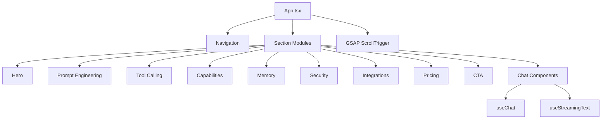

# NexusAI Frontend

<div align="center">


A cinematic, conversion-first SaaS frontend for an AI chat product.

[Live Demo](http://localhost:5173/) • [Features](#features) • [Architecture](#architecture) • [Quick Start](#quick-start)

</div>

## Product Snapshot

NexusAI is a high-impact product UI demo built to present an AI SaaS experience with modern interactions, scroll storytelling, and a production-style frontend architecture.

| Area | What It Delivers |
| --- | --- |
| Storytelling | Scroll-driven section choreography with GSAP pin and snap behavior |
| Product Feel | Rich motion and micro-interactions with Framer Motion |
| AI UX Demo | Simulated chat streaming, stop controls, and conversational flow |
| Scale Ready | Modular components, shared hooks, and typed domain models |
| Visual System | Tailwind tokens + reusable Radix-based primitives |

## Preview

Add your screenshots/GIFs here for a strong first impression on GitHub.


If needed:

```bash
mkdir -p docs/screenshots
```

## Features

1. Scroll Narrative Engine
- Global scroll snapping for pinned sections.
- Mixed pinned and natural-flow sections for better pacing.

2. Interactive AI Chat Demo
- Streaming response simulation via reusable hooks.
- Message bubbles, typing indicators, and stop-stream action.

3. Conversion-Focused Layout
- Hero, capabilities, security, integrations, pricing, and final CTA.
- Built for product demos, portfolio use, and SaaS landing adaptation.

4. Reusable UI Layer
- Radix-based primitives in a dedicated `ui` directory.
- Easy to extend with additional modules or design themes.

## Architecture



```text
src/
  components/
    chat/
    sections/
    ui/
    Navigation.tsx
  hooks/
    useChat.ts
    useStreamingText.ts
  types/
    index.ts
  App.tsx
```

## Tech Stack

- React 19
- TypeScript 5
- Vite 7
- Tailwind CSS 3
- Framer Motion
- GSAP + ScrollTrigger
- Radix UI
- Lucide React

## Quick Start

```bash
npm install
npm run dev
```

Open `http://localhost:5173/`

## Scripts

```bash
npm run dev      # Start dev server
npm run build    # Type-check + production build
npm run preview  # Preview production bundle
npm run lint     # Lint project
```

## Recruiter Notes

- Project emphasizes frontend architecture, motion design, and component system design.
- Built with an AI-assisted workflow and manually curated implementation decisions.
- You can review section modularity, hook design, and animation orchestration in code.

## Customization

- Update section content in `src/components/sections/`
- Tune visual tokens in `tailwind.config.js`
- Adjust scroll orchestration in `src/App.tsx`
- Extend chat behaviors in `src/components/chat/` and `src/hooks/useChat.ts`

## Deployment

```bash
npm run build
```

Deploy the generated `dist/` directory to static hosting.

## License

This project is licensed under the MIT License. See `LICENSE` for details.
